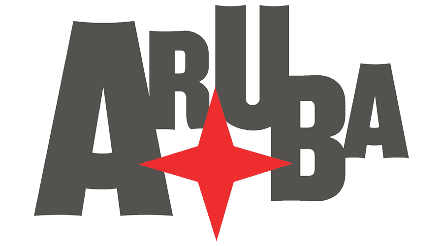

<a name="readme-top"></a>

<div align="center">
  
  <br/>
  <h3><b>Aruba Ruby Conference 2023</b></h3>
</div>

<!-- TABLE OF CONTENTS -->

# 📗 Table of Contents

- [📖 About the Project](#about-project)
  - [🛠 Built With](#built-with)
    - [Tech Stack](#tech-stack)
    - [Key Features](#key-features)
  - [🚀 Live Demo](#live-demo)
- [💻 Getting Started](#getting-started)
  - [Setup](#setup)
  - [Prerequisites](#prerequisites)
  - [Install](#install)
  - [Usage](#usage)
  - [Run tests](#run-tests)
  - [Deployment](#triangular_flag_on_post-deployment)
- [👥 Authors](#authors)
- [🔭 Future Features](#future-features)
- [🤝 Contributing](#contributing)
- [⭐️ Show your support](#support)
- [🙏 Acknowledgements](#acknowledgements)
- [❓ FAQ (OPTIONAL)](#faq)
- [📝 License](#license)

<!-- PROJECT DESCRIPTION -->

# 📖 Aruba Ruby Conference 2023 <a name="about-project"></a>

**Aruba Ruby Conference 2023** is a webpage built as a capstone project to showcase html, css, and javascript skills gained during Module 1 of the Microverse program.

## 🛠 Built With <a name="built-with"></a>

### Tech Stack <a name="tech-stack"></a>

- HTML
- CSS
- Javascript

<!-- Features -->

### Key Features <a name="key-features"></a>

- **Responsive Pages**
- **Mobile Menu interactions using JS**
- **Load webpage data using JS**

<p align="right">(<a href="#readme-top">back to top</a>)</p>

<!-- LIVE DEMO -->

## 🚀 Live Demo <a name="live-demo"></a>

- [Live Demo Link](https://dennis-every.github.io/arubyconf/)

<p align="right">(<a href="#readme-top">back to top</a>)</p>

<!-- GETTING STARTED -->

## 💻 Getting Started <a name="getting-started"></a>

To get a local copy up and running, follow these steps.

```sh
  cd my-folder
  git clone git@github.com:dennis-every/arubyconf.git
```

### Prerequisites

In order to run this project you need:

```sh
 npm install
```

### Setup

Clone this repository to your desired folder:

```sh
  cd my-folder
  git clone git@github.com:dennis-every/arubyconf.git
```

### Install

n/a

### Usage

Open index.html in your preferred browser.

### Run tests

To run tests, run the following command:

```sh
  npm install
```

```sh
  npx hint .
```

```sh
  npx stylelint "**/*.{css,scss}"
```

```sh
  npx eslint .
```

### Deployment

- Deployed with github pages at:
- https://dennis-every.github.io/arubyconf

<p align="right">(<a href="#readme-top">back to top</a>)</p>

<!-- AUTHORS -->

## 👥 Author <a name="authors"></a>

👤 **Dennis Every**

- GitHub: [@dennis-every](https://github.com/dennis-every)
- Twitter: [@dennis_every](https://twitter.com/dennis_every)
- LinkedIn: [dennis-every](https://linkedin.com/in/dennis-every)

<p align="right">(<a href="#readme-top">back to top</a>)</p>

<!-- FUTURE FEATURES -->

## 🔭 Future Features <a name="future-features"></a>

- [ ] **Make MORE button on the home page functional**
- [ ] **Tickets page**
- [ ] **Schedule page**

<p align="right">(<a href="#readme-top">back to top</a>)</p>

<!-- CONTRIBUTING -->

## 🤝 Contributing <a name="contributing"></a>

Contributions, issues, and feature requests are welcome!

Feel free to check the [issues page](../../issues/).

<p align="right">(<a href="#readme-top">back to top</a>)</p>

<!-- SUPPORT -->

## ⭐️ Show your support <a name="support"></a>

Please star this project if you like this project.

<p align="right">(<a href="#readme-top">back to top</a>)</p>

<!-- ACKNOWLEDGEMENTS -->

## 🙏 Acknowledgments <a name="acknowledgements"></a>

- Original design idea by [Cindy Shin in Behance](https://www.behance.net/adagio07)

<p align="right">(<a href="#readme-top">back to top</a>)</p>

<!-- FAQ (optional) -->

## ❓ FAQ (OPTIONAL) <a name="faq"></a>

- **Can I re-use your code?**

  - Sure, no problem!

- **How can I see the project?**

  - Just clone the repository as expained in the setup section, and open the index.html file in your preferred browser.

<p align="right">(<a href="#readme-top">back to top</a>)</p>

<!-- LICENSE -->

## 📝 License <a name="license"></a>

This project is [MIT](./MIT.md) licensed

<p align="right">(<a href="#readme-top">back to top</a>)</p>
